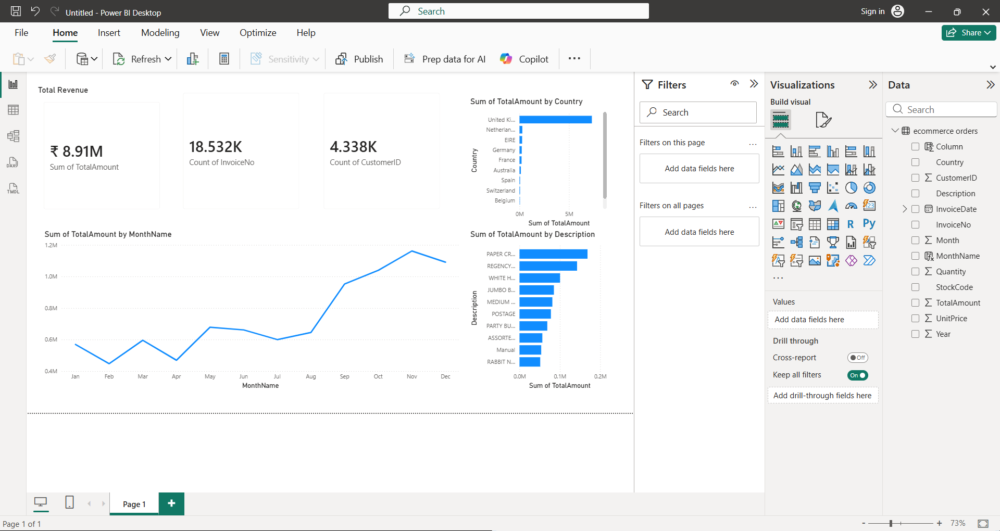

# 📊 Ecommerce Sales Dashboard

## 📌 Project Overview
This project analyzes eCommerce transaction data to uncover insights related to revenue trends, customer behavior, and product performance.

The project demonstrates an end-to-end data analytics workflow using Python, SQL, and Power BI.

---

## 🧰 Tools & Technologies
- Python (Pandas, Matplotlib)
- MySQL (Data Storage & Queries)
- Power BI (Dashboard Visualization)

---

## 📂 Project Structure

Ecommerce-Sales-Dashboard/
│
├── PowerBI/          # Power BI dashboard file
├── Notebooks/        # Python analysis notebook
├── SQL/              # SQL queries
├── Data/             # Dataset files
├── Screenshots/      # Dashboard preview
├── README.md
└── .gitignore

---

## 📊 Key Metrics
- Total Revenue: ₹8.91M
- Total Orders: 18.5K
- Total Customers: 4.3K

---

## 📈 Dashboard Features
- KPI Cards (Revenue, Orders, Customers)
- Monthly Revenue Trend
- Revenue by Country
- Top Products Analysis
- Interactive Filters

---

## 📷 Dashboard Preview

---

## 🔍 Key Insights
- Revenue shows strong growth towards the end of the year
- A small number of products contribute significantly to total revenue
- Majority of revenue comes from a few key countries
- Customer purchasing patterns indicate repeat buying behavior

---

## 🚀 How to Use
1. Open `.pbix` file in Power BI Desktop
2. Explore visuals and filters
3. Run SQL queries from `/SQL` folder if needed

---

## 💼 Project Outcome
This project demonstrates:
- Data cleaning and transformation
- SQL-based analysis
- Business intelligence dashboard creation
- Insight generation for decision-making

---